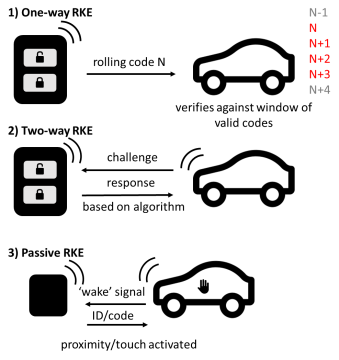
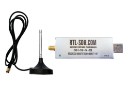
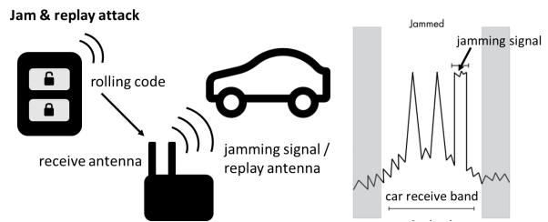
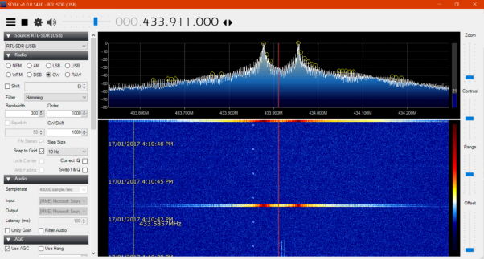
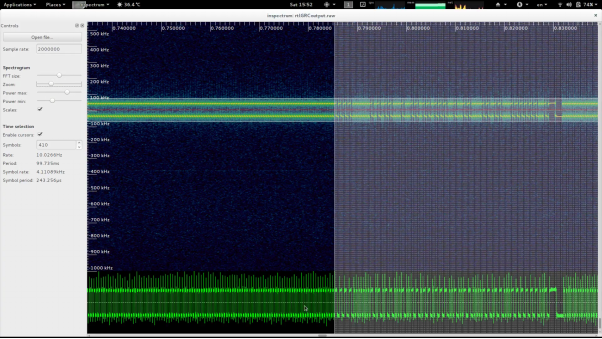
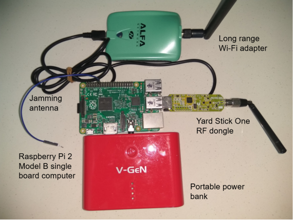
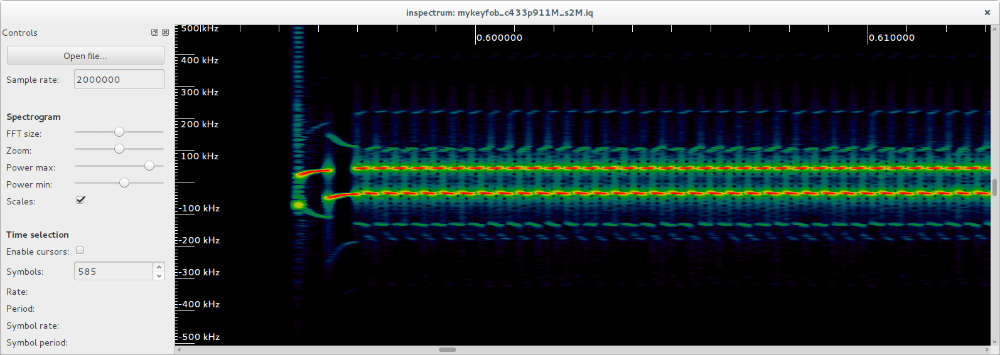
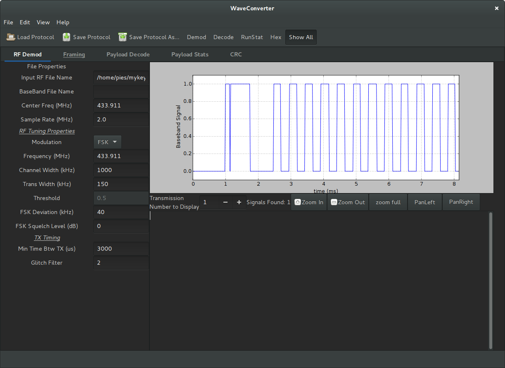

### Media
[RyscCorp Students post](https://store.ryscc.com/blogs/rysc-students/christopher-queensland-academy-for-science-mathematics-and-technology)

[RTL-SDR Blog post](https://www.rtl-sdr.com/explaining-and-demonstrating-jam-and-replay-attacks-on-keyless-entry-systems-with-rtl-sdr-rpitx-and-a-yardstick-one/)

[Cafe Scientifique QUT 2017](https://qasmt.eq.edu.au/qut-cafe-scientifique-2017/)

[Short unnarrated video of capture](https://www.youtube.com/watch?v=VFLYEQ_u7Mc)

# Jam and Replay Attack on Vehicular Keyless Entry Systems
#### Raspberry Pi version

Item | Price in AUD (store)
-----|--------------------
Raspberry Pi 2 Model B	| $50 (element14)
Yard Stick One RF dongle | $130 (NooElec)
Power bank	| <$30 (eBay)
Wire for antenna	| <$1 (any short piece of copper wire)
(optional) Wi-Fi adapter	| $15 (AliExpress)
**Total**	| **$211 ($226 with Wi-Fi adapter)**

#### Arduino version
Item | Price in AUD (store)
-----|--------------------
Arduino Pro Mini	|$3 (eBay)
CC1101 RF transceiver|	$6 (eBay)
Breadboard	|$3 (eBay)
Hook-up wire	|$3 (eBay)
FTDI (one-time use for programming)	|$5 (eBay)
**Total**	|**$20**

**Following is an extract of the paper written. It is aimed as a basic overview for those getting started in RF and does not go into much detail. If any RF experts spot errors, please let me know!**

## Background of Keyless Entry Systems

A remote keyless entry system simply refers to any electronic lock that functions without the use of a mechanical key. Commonly, this comes in the form of a key fob, with buttons that communicate using radio frequency (RF) signals with a receiver to perform a certain action, such as locking or unlocking a vehicle.

### Types of Remote Keyless Entry
Keyless entry systems can be categorised into three broad types, as seen below.

*Figure 1: One-way, two-way & passive RKE illustration*

1. A one-way RKE requires a manual button press to perform an action. The vehicle receives the signal and confirms that it is a valid code, then performs the required action. With a rolling code system, a cryptographically secure pseudorandom number generator (PRNG), installed in the vehicle and the key fob, is used to periodically change the required code after a keypress, usually with a buffer to account for accidental out-of-range button presses. One-way RKEs are the simplest and most common form of keyless entry, and its security will be the focus of this report (van de Moosdijk & Visser, 2009, pp. 8-9).

2. Two-way RKEs require a 'response' from the key fob given a certain 'challenge' from the vehicle (Alrabady & Mahmud, 2005, p. 2).

3. Passive RKEs (abbr. PKEs) automatically unlock within a certain radius or upon the user touching a door handle; they are usually paired with a push-button ignition switch (van de Moosdijk & Visser, 2009, p. 9).

## Proof-of-concept device
### Quick Intro to RF Hardware & Software
Several new technologies have made RF security testing simpler and more affordable for hobbyists and researchers, the most important development being the software-defined radio.

*Figure 2: RTL-SDR used to analyse signal (RTL-SDR.com, 2013)*

A software-defined radio is a radio system where components traditionally implemented in hardware, such as filters and demodulators, are instead implemented in software (Dillinger, Madani, & Alonistioti, 2003). The setup typically involves an RF front end and an analogue-to-digital converter, connected to a computer via USB. The computer performs the complex tasks, such as demodulation, which refers to extracting the original signal from a carrier wave. Recently, it was found that a common USB TV tuner dongle, the RTL-SDR (refer Figure 2), could be made to send raw I/Q data to a computer (in-phase and quadrature, referring to the real and imaginary components of an RF signal) (Whyte, 2013). Hence, it became affordable for the average hobbyist to have a wide-band spectrum analyser. At the time of writing, such a dongle could be obtained for less than 10 USD (eBay Inc., 2017).

In addition, advances in computing hardware and software have allowed for complex signal analysis using graphical flow graph software, such as GNURadio, capable of manipulating, decoding and encoding data for use with software defined radios (The GNU Radio Foundation, Inc., 2017). Another important development is the popular Raspberry Pi single board computer, which for 35 USD offers a full Linux operating system running on a 900Mhz quad-core processor, 4 USB ports, display outputs and 40 general purpose input-output (GPIO) pins, which provides an easy-to-use, affordable testing base for the experimental jam and replay attack outlined below (Raspberry Pi Foundation, 2015).

### Overview of Jam and Replay Attack
The attack that was carried out against the one-way RKE is a jam and replay attack. A high level overview and illustration of this attack is shown in Figure 3.

*Figure 3: Jam and replay attack*

The attacker utilises a device with full-duplex RF capabilities (simultaneous transmit and receive) to produce a jamming signal, in order to prevent the car from receiving the valid code from the key fob. This is possible as RKEs are often designed with a receive band that is wider than the bandwidth of the key fob signal (refer Figure 3, right). The device simultaneously intercepts the rolling code by using a tighter receive band, and stores it for later use. When the user presses the key fob again, the device captures the second code, and transmits the first code, so that the user’s required action is performed (lock or unlock) (Kamkar, 2015). This results in the attacker possessing the next valid rolling code, providing them with access to the vehicle. The process can be repeated indefinitely by placing the device in the vicinity of the car. Note that if the user unlocks the car using the mechanical key after the first try, the second code capture is not required, and the first code can be used to unlock the vehicle.

### Initial Reconnaissance
The first step in reverse engineering the key fob was to determine its operating frequency. The key fob case was inspected, however there were no visible frequencies or radio IDs listed that offered clues to the operating frequency. Hence, the RTL-SDR was utilised. Common unlicensed frequencies in the International Telecommunication Union Region 3, containing Australia, were tuned to and the key fob repeatedly pressed until a signal became visible on the fast Fourier transform (FFT) plot, which displays a live view of the RF spectrum (refer Figure 4, top half). The horizontal axis represents frequency in megahertz and the vertical axis the amplitude in decibels relative to full scale (dBFS). A waterfall plot is shown in the bottom half, which plots the FFT over time, with the colours representing signal amplitude (blue to red, in increasing signal strength).

*Figure 4: FFT plot of frequency versus signal strength showing key fob signal at 433.911MHz*

### Identifying Modulation
As seen in Figure 4, there are two peaks at 433.878MHz and 433.957MHz, with the entire signal centred at 433.911MHz. Thus, it was deduced that the key fob used a modulation scheme known as 2-FSK (frequency shift keying), where two discrete frequencies are used to transfer digital data. However, the FFT plot does not provide information regarding how the data is actually encoded.

### Automated Decoding
To further analyse the signal, a Debian setup was utilised, and the gqrx SDR receiver software used to record the key fob I/Q data. The data was passed to inspectrum, an open-source waveform analysis tool (Software in the Public Interest, Inc., 2017; Csete, 2016; Walters, 2017).
A screenshot of the beginning of the signal is shown in Figure 5.

*Figure 5: Inspectrum signal analyser displaying preamble, sync-word and rolling code data*

The vertical axis represents the frequency offset from the centre frequency (433.911MHz) in kHz, whilst the horizontal axis is time in seconds. As established, the signal visibly oscillates between two frequencies. The consistent, repetitive section of the signal on the left hand side of Figure 5 is the preamble, which is used to synchronise the clock of the receiver to correctly decode the transmitter’s packets. Following the preamble is a four-bit sync-word, which in this case is 1100110011001100, or 0xCCCC in hexadecimal. This sync-word is used to avoid clashes with other devices operating in that band. Following the sync-word is the actual rolling code signal, which is repeated twice, divided by a gap, seen in the far right of Figure 5. At first guess, the signal appears to be Manchester encoded, which means every bit (zero or one) is either encoded as high then low, or low then high, for the same period of time (refer Figure 6).

*Figure 6: Manchester encoding illustration (Wikimedia Commons, 2004)*

Initially, the signal was decoded by manually capturing I/Q data from the RTL-SDR and using the open-source waveconverter project to demodulate the signal, and then decode it based on pulse lengths (technical details are omitted) (Clark, 2017). However, this process was very tedious and not easily scalable. The system had to be simplified to use dedicated hardware instead of a general purpose SDR.

### Jam and Replay Hardware
To simplify the system, a Yard Stick One USB RF transceiver was used, that is capable of receiving and transmitting in various industrial, scientific and medical (ISM) unlicensed bands, including 433MHz, with wide support for modulations such as FSK, ASK (amplitude-shift keying) and OOK (on-off keying). The device was controlled using an interactive Python shell, which allows commands such as d.setMdmFreq(433900000) to be set, in this case setting the modem frequency to 433.9MHz. Further settings such as the modem modulation, frequency deviation, data rate (calculated using inspectrum), channel bandwidth, and packet sync mode were configured to match the key fob’s characteristics.

### Replaying Signal
Upon running the Python script and pressing the key fob, data was consistently received, and there were slight deviations in each packet, confirming that the key fob utilised rolling code. I then wrote another function to transmit the signal, by converting the hexadecimal code to the correct BitArray format, and using the d.rfXmit() function. As expected, this unlocked the test automobile when run.

### Jamming Signal
To create the jamming signal, the open-source [rpitx](https://github.com/F5OEO/rpitx) software was utilised, which is capable of transmitting RF signals via the Raspberry Pi’s GPIO pins. Specifically, the variable-frequency oscillator (VFO) mode was used, as it offers “precise frequency resolution” (Okcestbon, 2016). A carrier signal was transmitted at 433.850MHz, slightly below the operating frequency of the key fob, however within the automobile’s receive bandwidth.
`sudo ./rpitx –m VFO –f 433850`

### Jam and Replay Attack
The Python replay program was run simultaneously with rpitx, and resulted in the car not locking or unlocking. However, as expected, the signal was captured by the Yard Stick One, and could be replayed at any time to unlock the car. In the interest of responsible disclosure, photographic evidence of the device unlocking the vehicle will not be released as this could compromise the security of many vehicles still in use.

At this point, the program was ported to a Raspberry Pi single-board computer as it is more portable and affordable compared to a dedicated laptop. A power bank was used to power the Raspberry Pi, and a long-range Wi-Fi dongle allowed communication via secure shell (SSH) from the laptop for initial configuration. An image of the final Raspberry Pi jam and replay setup is shown in Figure 7.

*Figure 7: Photograph of final Raspberry Pi jam & replay setup showing connections to Wi-Fi, power and RF dongle*

#### Possible Extension for Two-Way RKEs or PKEs
The basic techniques applied here can be applied to more complex two-way or passive RKEs, using similar hardware. As an example, in a passive keyless entry system, the vehicle emits a low-frequency (LF) signal upon user interaction, such as touching the door handle, to alert all key fobs in the vicinity. The information transmitted via the LF signal is decoded by the key fob, which responds with a valid security code that is validated by the vehicle (Alrabady & Mahmud, 2005).

A PKE system can be theoretically compromised by a jam and replay attack, however the algorithm for the “response” code given the “challenge” from the vehicle must be reverse-engineered. An even simpler ‘relay’ attack requires an attacker to stand near the vehicle and amplify the LF signals, then transmit this to another attacker who is within close range of the owner’s key fob. The valid response from the key fob can then be transmitted back to the first attacker to unlock the vehicle (Francillon, Danev, & Capkun, 2010).

## Old Readme
**NOTE:** Not final code. Needs to be implemented for each model of vehicle.

Attempt at RollJam, jam and replay keyless entry systems. Thank you to [Samy Kamkar](http://samy.pl/) who first provided me with the inspiration to perform software defined radio research, view his more polished RollJam device [here](https://www.wired.com/2015/08/hackers-tiny-device-unlocks-cars-opens-garages/).

Uses GNURadio to record IQ data from an RTL-SDR then decodes with a custom protocol made on wave-converter and parses the output to return the hex data.

Latest version utilises a [Yard Stick One RF Transceiver](https://greatscottgadgets.com/yardstickone/) with RFCat firmware approx $100USD. Thanks to [RyscCorp](https://ryscc.com/) for sponsoring my purchase.

Will try to transfer register settings when testing is complete to a cheaper CC1101 chip/$1 433MHz chip and Arduino (about 50% done).

Refer [waveconverter](https://github.com/paulgclark/waveconverter) and [GNURadio](http://gnuradio.org/)

Further documentation will be uploaded ~~in a few months time~~soon, including a paper on implications and recommendations for manufacturers, end-users and third parties.

### Jamming
Attach an antenna to pin 12 of the GPIO header.
Note that output is unfiltered and creates harmonics, probably illegal without licence.
`sudo ./rpitx -m VFO -f [FREQ IN HZ]`

### Screenshots
**Inspectrum view of the I/Q taken from GNURadio**

**Wave Converter demod settings**

